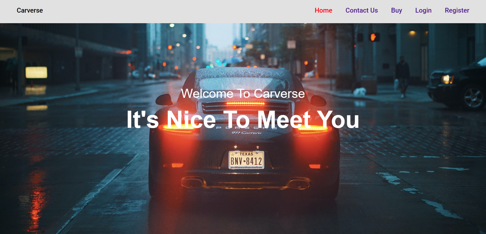
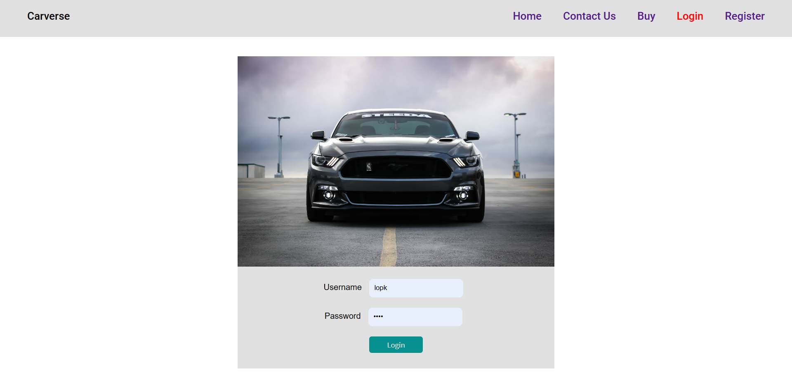

# Carverse
## home
* It is the landing page of website

## contact us
* by using this form you can connect to me
 * this is going to send a mail to my g-mail via external api service.

## buy
 * this route is shows if you are loged in 
 
 * if not loged in then :
 
 
## login
  * log into your previously registered account
  

## register
 * register your acoount 

## logout
 * you are logged out and redirected to login page

##  Get Started:
 clone the repository
   

make sure node and mongodb is installed in your machine
 type 
 #### $ npm i 
  in the terminal, Make sure the directroy is the cloned reposetory folder
 type
 #### $ node app.js 
 in the terminal and open http://localhost:3000/ in your browser.

node packages used 
    "express": "^4.18.2",
    "path": "^0.12.7"
    "ejs-mate": "^4.0.0",
    "mongoose": "^6.9.0",
    "express-session": "^1.17.3",
    "connect-mongo": "^3.2.0",
